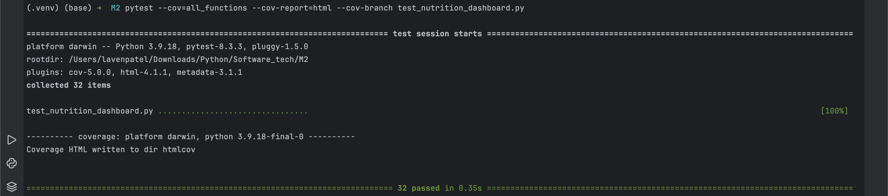

# Coverage Testing Report

Please provide your GitHub repository link.
### GitHub Repository URL: https://github.com/Swigstan1810/Milestone1_Group32

---

The testing report should focus solely on <span style="color:red"> testing all the self-defined functions related to 
the five required features.</span> There is no need to test the GUI components. Therefore, it is essential to decouple your code and separate the logic from the GUI-related code.

You should perform statement coverage testing and branch coverage testing. For each type, provide a description and an analysis explaining how you evaluated the coverage.

## 1. **Test Summary**
The table below lists all the tested functions related to the five required features. These functions were tested to ensure correctness and robustness, and were separated from GUI logic:

| **Tested Functions**                                 |
|------------------------------------------------------|
| `read_data_file_csv(filepath)`                       |
| `get_records_in_dataframe(food, df)`                 |
| `get_sum_value_in_dataframe(food, df)`               |
| `get_nutrition_range_filter(nutrient, min_value, max_value, df)` |
| `get_highest_lowest_nutrition_level_filter(nutrient, df)` |
| `get_list_5food_max_nutrition(nutrient, df)`         |
| `get_list_5food_min_nutrition(nutrient, df)`         |
| `get_two_foods_with_nutritions(food1, food2, df)`    |


---

## 2. **Statement Coverage Test**

### 2.1 Description

Statement coverage ensures that every statement in the code is executed at least once during the testing process. The objective was to ensure that all statements within the functions related to the five required features were covered by test cases.

The test cases were designed by considering all possible input combinations, including valid inputs, edge cases, and invalid inputs. For each function, the following scenarios were covered:

1)Valid input data: Testing with proper DataFrame and expected values.
2)Invalid input data: Testing with incorrect data types (e.g., passing a string instead of a DataFrame).
3)Edge cases: Testing with boundary values (e.g., nutrient values at minimum and maximum limits).

For instance:

1)get_records_in_dataframe() was tested with a valid food name and an invalid food name.
2)get_sum_value_in_dataframe() was tested with a food name that exists in the DataFrame and one that does not.
3)get_nutrition_range_filter() was tested with nutrient ranges within and outside valid bounds.

### 2.2 Testing Results
The command below was used to run the statement coverage test:

```commandline
pytest --cov=all_functions --cov-report=term
```
The output showed that 100% of the statements in all_functions.py were executed during testing. Here’s a snapshot of the terminal output:


## 3. **Branch Coverage Test**

### 3.1 Description

Branch coverage measures whether each branch of a control structure (i.e., every possible decision point) is tested. This includes if-else conditions, try-except blocks, and loops. The goal was to ensure that all decision paths in the functions were tested.

The test cases were crafted to cover all branches:

True and False branches: Ensuring all conditional paths are covered, such as testing whether certain values exist in the DataFrame.
Exception handling: Testing how functions behave when exceptions are raised, such as reading a file that does not exist.
Different input scenarios: Testing with various nutrients and value ranges to ensure the function behaves as expected.
For example:

In get_highest_lowest_nutrition_level_filter(), both the minimum and maximum values were tested.
In read_data_file_csv(), scenarios where the file exists and does not exist were tested.

### 3.2 Testing Results
The command below was used to run the branch coverage test:
```commandline
pytest --cov=all_functions --cov-branch --cov-report=term
```
The output showed 100% branch coverage for all the tested functions:


