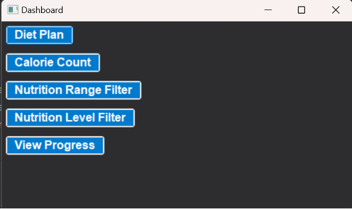
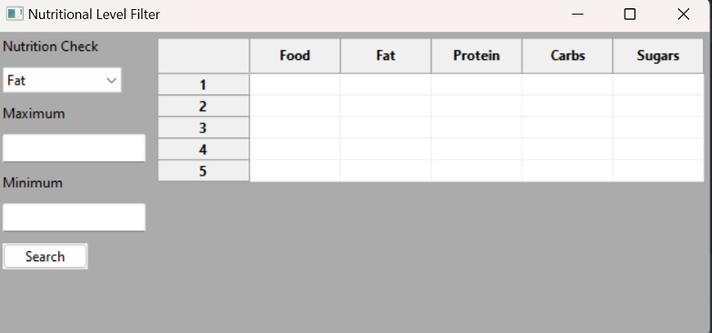
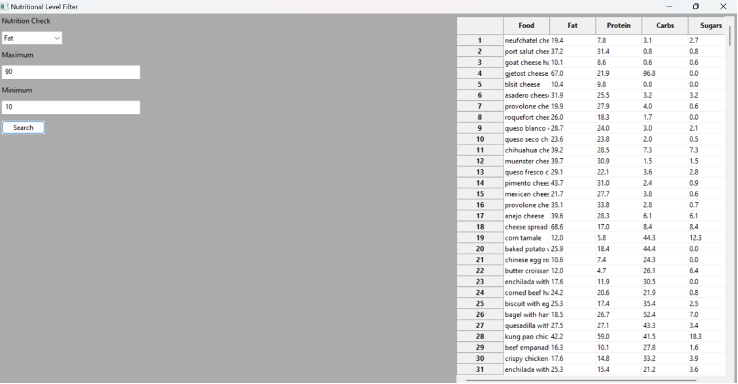
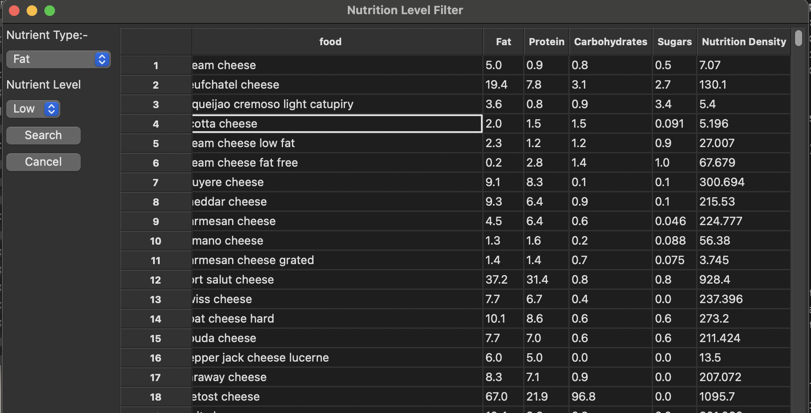
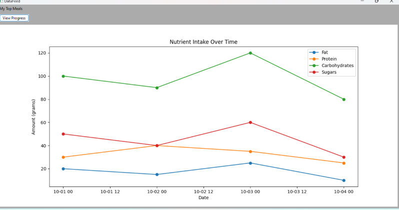

# Executive Summary

Please provide your GitHub repository link.
### GitHub Repository URL: https://github.com/Swigstan1810/Milestone1_Group32

---
## 1. Diet Plan
### Description  
The Diet Plan feature provides users with a personalized meal plan based on their dietary preferences and nutrition data from the food dataset. This feature allows users to track their diet and evaluate their meal choices to align with healthy eating habits. The tool also generates visual feedback on their progress.

### Steps
1. Access the Dashboard: Launch the application, and the main dashboard will appear.
2. Select the "Diet Plan" Feature: Click the "Diet Plan" button from the list of available features on the dashboard.
3. View Meal Suggestions: A new window will open, displaying the recommended meals and their nutritional data.
4. Track Progress: Click on the “View Progress” button to generate charts showing your dietary progress over time, based on the meal choices.
5. Visual Feedback: Nutrient intake will be displayed in bar charts to help you monitor fat, protein, carbs, and sugars in the recommended meals.

### Screenshots
Include screenshots for each step demonstrating the use of this feature.  

---

## 2. Calorie Count
### Description  
The Calorie Count feature allows users to search for specific food items in the dataset and view their nutritional values, including fat, protein, calories, and sugars. Additionally, it generates a pie chart to visually display the breakdown of the selected food’s nutrition, helping users to make informed choices.

### Steps
1. Select the "Calorie Count" Button: Click the "Calorie Count" button from the dashboard to open the calorie count tool.
2. Enter a Food Item: Type the name of a food item in the search bar. You can enter partial or full names, and the tool will attempt to find a match in the dataset.
3. View Nutritional Information: The tool will display the food’s total fat, protein, calories, and sugar content once the search is complete.
4. Visualize with a Pie Chart: The nutritional breakdown will also be displayed as a pie chart, showing the proportion of fat, protein, carbohydrates, and sugars in the selected food item.
5. Modify Search: If needed, change the search term to view the data for another food item.

### Screenshots
Include screenshots for each step demonstrating the use of this feature.  

---

## 3. Nutrition Range Filter
### Description  
The Nutrition Range Filter feature allows users to filter the foods in the dataset based on specific nutritional ranges. For example, users can filter foods that contain between 10-20 grams of fat or 5-10 grams of protein. This feature helps users find foods that meet their dietary requirements quickly.

### Steps
1. Click the "Nutrition Range Filter" Button: Select the "Nutrition Range Filter" button from the dashboard to open the filtering tool.
2. Select Nutrient to Filter By: From the dropdown menu, choose the nutrient you wish to filter by, such as fat, protein, carbohydrates, or sugars.
3. Enter Minimum and Maximum Values: Input the desired range of nutrient values. For example, to filter for foods containing 10-20 grams of fat, enter 10 in the “Minimum” field and 20 in the “Maximum” field.
4. Click "Search": The tool will return a list of foods that meet your specified nutrient range.
5. View Results: The filtered foods and their nutritional values will be displayed in a table format. You can further modify the search range if needed.

### Screenshots
Include screenshots for each step demonstrating the use of this feature.  

---

## 4. Nutrition Level Filter
### Description  
The Nutrition Level Filter feature enables users to filter foods based on predefined nutrient levels such as "low," "mid," or "high" for specific nutrients like fat, protein, or carbohydrates. This feature helps users quickly identify foods that meet their dietary goals, whether they are looking for low-fat options or high-protein foods.

### Steps
1. Open the "Nutrition Level Filter" Tool: Click the "Nutrition Level Filter" button on the dashboard.
2. Select Nutrient Type: From the dropdown menu, select the type of nutrient you want to filter by (e.g., fat, protein, carbohydrates, or sugars).
3. Choose the Nutrient Level: Select from the available levels: low, mid, or high. For example, choose "low" to find foods with a low amount of the selected nutrient.
4. Click "Search": The tool will filter the dataset to show foods that match the selected nutrient level.
5. View the Results: The filtered food list will be displayed in a table, showing the food’s name and corresponding nutrient values.
6. Adjust Levels: You can modify the nutrient type or level and perform the search again for a new set of results.

### Screenshots
Include screenshots for each step demonstrating the use of this feature.  

 

---

## 5. View Progress
### Description  
The View Progress feature provides a graphical overview of the user’s nutrient intake over time. Users can track the intake of key nutrients like fat, protein, carbohydrates, and sugars over a defined period, and visualize their progress using line charts. This feature is useful for monitoring dietary habits and making adjustments to meet health goals.

### Steps
1. Click the "View Progress" Button: On the dashboard, select the "View Progress" button to open the progress tracker.
2. View Nutritional Progress: The system will automatically load the user’s dietary data and generate a line chart showing nutrient intake over time for the tracked meals.
3. Interpret the Line Chart: The chart will plot values for fat, protein, carbohydrates, and sugars, helping the user identify trends in their nutrient intake.
4. Adjust Time Period (if applicable): Users can view progress for different time periods by adjusting the dataset used to generate the graph.

### Screenshots
Include screenshots for each step demonstrating the use of this feature.  

---
