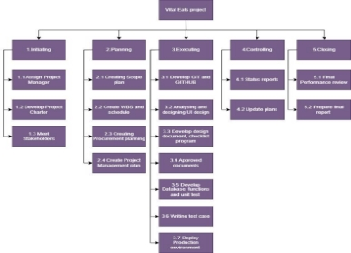
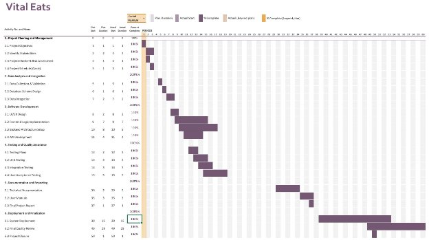

Project Plan 

Project Name: VitalEats Group Number: 32 Team members 

|Student No. |Full Name |GitHub Username |Contribution (sum to 100%) |
| - | - | - | - |
|s5362233 |Shubham |Shubham2014-prog |33\.3% or Equal |
|s5364886 |Laven Vinod Patel |swigstan1810 |33\.3% or Equal |
|s333333 |Drishti Madaan |drishtimadaan2025 |33\.3% or Equal |

Brief Description of Contribution 

s5364886, Laven Vinod Patel 

Accomplishments: Completed the Project Objectives, Project Stakeholders, and Visual Design sections. Also worked on the System Vision, including Problem Background, System Capabilities/Overview, and Potential Benefits. 

s5362233, Shubham 

Accomplishments: Completed the Project Scope, Work Breakdown Structure, Structural Design, User Requirements, Software Requirements, Use Case Diagrams, and Use Cases. 

s333333, Drishti Madaan 

Accomplishments: Completed the remaining sections of the project. 

 

Table of Contents 

\*  Project Plan 

- 1. Project Overview 
  - 1.1 Project Objectives 
  - 1.2 Project Stakeholders 
  - 1.3 Project Scope 
- 2. Work Breakdown Structure 
- 3. Activity Definition Estimation 
- 4. Gantt Chart 

 

1\. Project Overview 

1. Project Objectives 

Vital Eats aims to develop an advanced, user centric tool for analysing food nutritional data. The tool will allow users to search for food items from a comprehensive food database and visualize their nutritional content, focusing on key metrics such as calories, fat, protein, and carbohydrates. By offering clear and accessible data visualizations, Vital Eats will empower users to make healthier and more informed dietary choices, promoting better nutritional awareness and assisting individuals in planning balanced diets. 

2. Project Stakeholders 

Primary Stakeholders: 

- Development Team (Group 32 Members): 

The three members of Group 32 are responsible for the complete project lifecycle, including requirements gathering, design, development, testing, and documentation. Each member will take on specific roles while also collaborating on key tasks. 

- Team Members: 

S5232738: Drishti Madaan, Project Manager & Backend Developer S5364886: Laven Vinod Patel, Lead Developer & Frontend Developer S5362233: Shubham, Data Analyst & Tester 

- End Users: 

Healthconscious individuals, fitness enthusiasts, and nutrition focused users who seek to analyse and visualize food nutritional data for personal use. The tool will be designed with these users in mind, ensuring it is intuitive and meets their needs. 

- Secondary Stakeholders: 
1) Nutritionists/Dietitians: 

Professionals who might use the Vital Eats tool to assist clients with dietary guidance, nutritional education, and meal planning. Their insights could help refine the tool’s features for professional use, making it an asset in clinical or advisory settings. 

2) Potential Investors: 

Companies like MyFitnessPal, Cronometer, Noom, and HealthifyMe may be interested in Vital Eats for integration into their platforms or as a potential acquisition to enhance their offerings. These stakeholders could influence the tool's scalability and market positioning. 

3) Academic Institutions: 

Universities and research bodies focusing on nutrition, dietetics, or public health could use Vital Eats for research purposes or as an educational tool. Their feedback could be crucial in ensuring the tool meets academic and research standards. 

3. Project Scope 
1. In Scope: 
- Development of the Vital Eats Nutritional Analysis Tool: Utilizing a reliable and comprehensive food database, the tool will be designed and developed to meet user needs. 
- Design and Implementation of an Intuitive Interface: The user interface will be 

  userfriendly, allowing for easy food searches and data visualization. 

- Creation of Visual Representations: Interactive charts and graphs will display nutritional data in a clear and informative manner. 
- User Testing: Extensive user testing will ensure the tool meets the needs of the target audience and is free from major issues or bugs. 
2. Out of Scope: 
- Personalized Meal Plans: Creation of customized meal plans tailored to individual users’ preferences or health goals is beyond the current scope. 
- Realtime Updates or Synchronization: Continuous updates or synchronization with external food databases are not included in this phase. 
- Integration with External Health Tracking Apps: The current scope does not cover integration with external health tracking apps, wearable devices, or thirdparty systems. 
- Mobile Application Development: At this stage, developing a mobile version of the tool is out of scope. 

2\. Work Breakdown Structure 

1. Project Planning and Management 
   1. Define Project Objectives (Duration: 2 days, Start: Day 1, End: Day 2) 
   1. Identify and Engage Stakeholders (Duration: 2 days, Start: Day 3, End: Day 4) 
   1. Develop Project Charter and Risk Assessment (Duration: 2 days, Start: Day 5, End: Day 6) 
   1. Create Detailed Project Schedule (Gantt Chart) (Duration: 1 day, Start: Day 7, End: Day 7) 
1. Data Analysis and Integration 
   1. Data Collection and Validation (Duration: 4 days, Start: Day 8, End: Day 11) 
   1. Database Schema Design (Duration: 3 days, Start: Day 12, End: Day 14) 
   1. Data Integration into the Database (Duration: 2 days, Start: Day 15, End: Day 16) 
1. Software Development 
   1. UI/UX Design and Wireframing (Duration: 5 days, Start: Day 17, End: Day 21) 
   1. Frontend Logic Implementation (Duration: 7 days, Start: Day 22, End: Day 28) 
   1. Backend Architecture Setup (Duration: 8 days, Start: Day 29, End: Day 36) 
   1. API Development (Duration: 4 days, Start: Day 37, End: Day 40) 
1. Testing and Quality Assurance 
   1. Develop Testing Plans (Duration: 2 days, Start: Day 41, End: Day 42) 
   1. Unit Testing (Duration: 3 days, Start: Day 43, End: Day 45) 
   1. Integration Testing (Duration: 3 days, Start: Day 46, End: Day 48) 
   1. User Acceptance Testing (UAT) (Duration: 3 days, Start: Day 49, End: Day 51) 
1. Documentation and Reporting 
   1. Technical Documentation (Duration: 2 days, Start: Day 52, End: Day 53) 
   1. User Manuals (Duration: 2 days, Start: Day 54, End: Day 55) 
   1. Final Project Report (Duration: 1 day, Start: Day 56, End: Day 56) 
1. Deployment and Finalization 
1. System Deployment on Selected Platform (Duration: 2 days, Start: Day 57, End: Day 58) 
1. Final Quality Review and Approval (Duration: 1 day, Start: Day 59, End: Day 59) 
1. Project Closure and Lessons Learned (Duration: 1 day, Start: Day 60, End: Day 60) 

3. Activity Definition Estimation 

The project activities are defined based on the Work Breakdown Structure (WBS) and include tasks such as defining project objectives, identifying stakeholders, developing the project charter, and creating a detailed project schedule. Each activity is assigned to specific team members, ensuring clear ownership and responsibility. For example, data collection and validation tasks are handled by the Data Analyst, while the frontend and backend development are managed by the respective developers. The estimated duration for each activity ranges from 1 to 8 days, allowing for comprehensive planning and Gantt chart creation to track the progress. 

|Activity #No |Activity Name |Brief Description |Duration |Responsible Team Members |
| :-: | - | - | - | :-: |
|1 |Define Project Objectives |Outline project objectives and establish key requirements. |2 days |Group 32 |
|2 |Identify and Engage Stakeholders |Engage with stakeholders for input and feedback. |2 days |Project Manager |
|3 |
Develop Project Charter 

& Risk 
|Create a project charter and perform a risk assessment. |2 days |Project Manager |
|4 |Create Detailed Project Schedule |Develop a Gantt chart for the project timeline. |1 day |Project Manager |
|5 |Data Collection and Validation |Collect data, perform cleansing and validation. |4 days |Data Analyst |
|6 |Database Schema Design |Design a schema to organize data logically and efficiently. |3 days |Data Analyst |
|7 |Data Integration into the Database |Import validated data into the database. |2 days |Data Analyst |
|8 |UI/UX Design and |Design user interface and create |5 days |UI/UX Designer |

||Wireframing |wireframes. |||
| :- | - | - | :- | :- |
|9 |Frontend Logic Implementation |Implement frontend logic and develop data visualizations. |7 days |Frontend Developer |
|10 |Backend Architecture Setup |Design and implement the backend architecture. |8 days |Lead Developer |
|11 |API Development |Develop APIs for data queries and processing. |4 days |Lead Developer |
|12 |Develop Testing Plans |Outline testing strategies, including unit and integration tests. |2 days |Tester |
|13 |Unit Testing |Test individual components to ensure functionality. |3 days |Tester |
|14 |Integration Testing |Test how different system components work together. |3 days |Tester |
|15 |User Acceptance Testing (UAT) |Engage end users to test the tool and provide feedback. |3 days |Tester |
|16 |Technical Documentation |Document technical details, including architecture and code. |2 days |Group 32 |
|17 |User Manuals |Create guides to help users navigate the tool. |2 days |Group 32 |
|18 |Final Project Report |Summarize project outcomes, lessons learned, and next steps. |1 day |Group 32 |
|19 |System Deployment |Deploy the tool to the intended platform. |2 days |Group 32 |
|20 |Final Quality Review and Approval |Conduct final review to ensure quality standards are met. |1 day |Group 32 |
|21 |Project Closure and Lessons Learned |Finalize project and document lessons learned. |1 day |Group 32 |

4. Gantt Chart 

The provided Gantt chart outlines a 60-day project, breaking down tasks by phase and activity. The "Vital Eats" project is divided into six main phases: Project Planning and Management, Data Analysis and Integration, Software Development, Testing and Quality Assurance, Documentation and Reporting, and Deployment and Finalization. For each task, the planned start and duration are listed alongside the actual start and duration to track deviations from the original schedule. 

