## Vital Eats Application
  A Python desktop application for tracking and analyzing calorie and macronutrient intake. Designed with an intuitive GUI, this tool helps users monitor their daily calorie and nutrient intake by providing total calories, fats, proteins, and sugars based on user input.

## Features
   - Nutrient Breakdown Display: Shows total calories, fats, proteins, and sugars from food items.
   - Search Functionality: Allows users to enter food items and retrieve a comprehensive nutritional breakdown.
   - Simple GUI: Built with an easy-to-use interface, enabling quick access to dietary information.

## Installation
 # Prerequisites
  1. Python 3.8+: Ensure Python is installed on your system.
  2. Package Manager: pip to manage Python packages.


 
### 1. Clone this repository to your local machine:

```bash
git clone <repository-link>
cd Calorie-Count
```

### 2. Install Dependencies
The dependencies required for this project are listed in `requirements.txt`. Run the following command to install them:

```bash
pip install -r requirements.txt
```

### 3. Requirements
Your setup requirements should include:

```bash
wxPython==4.1.1 or greater
pandas==1.5.0 or greater
numpy==1.23.4 or greater
pytest==7.1.2 or greater
pytest-cov==3.0.0 or greater
```

#### This includes:
- **wxPython**: For building the desktop GUI interface.
- **pandas**: To manage and analyze tabular data related to food nutrition.
- **numpy**: Provides support for numerical operations, essential for data manipulation.
- **pytest**: For running tests on the application.
- **pytest-cov**: To generate test coverage reports.
=======
 #  Repository Workflow
  1. Clone this repository to your local machine:
    ```bash
      git clone <repository-link>
      cd Calorie-Count
    ```
  2. Install Dependencies 
   The dependencies required for this project are listed in requirements.txt. Run the following command to install them: 
    ```bash
      pip install -r requirements.txt
    ```
  3. Requirements
   Your Setup requirements should contain:
   ```bash
    wxPython==4.1.1 or greater
    pandas==1.5.0 or greater
    numpy==1.23.4 or greater
    pytest==7.1.2 or greater
    pytest-cov==3.0.0 or greater
   ```


## Usage:
 1. Launch the application:
    ``bash
      python app.py
 2. Enter a food item in the Total Calories search field and click the Search button to fetch its nutritional information.

 3. The application will display:

   - Total Calories
   - Total Fat
   - Total Protein
   - Total Sugars

  This information is displayed in the lower section of the GUI, providing a quick overview of the selected food's nutritional content.
 

## Testing
To run tests, navigate to the project directory and execute:
```bash
   pytest --cov=all_functions.py
```
This command will run all tests in the tests/ directory and generate a coverage report, showing which parts of the code are tested.

## Screenshots
1. Testing Results:-
    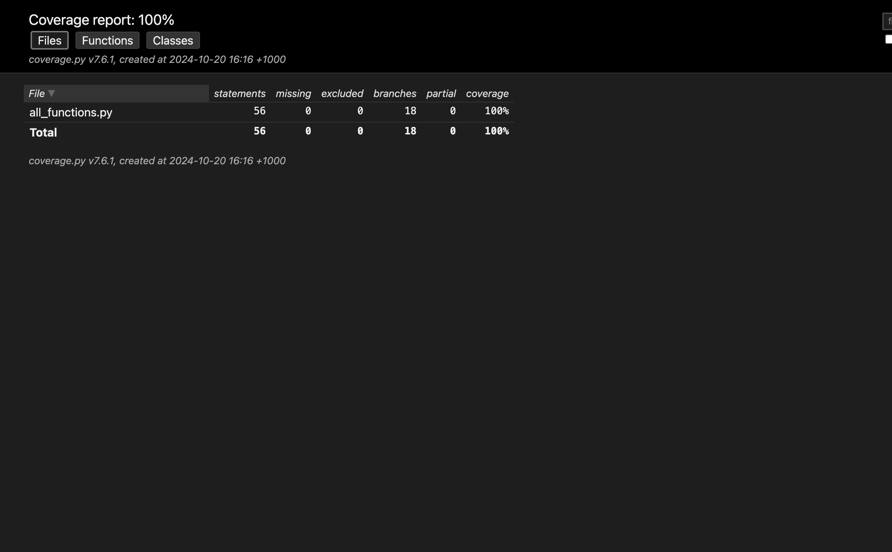
    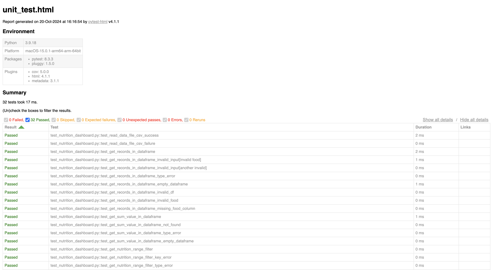
    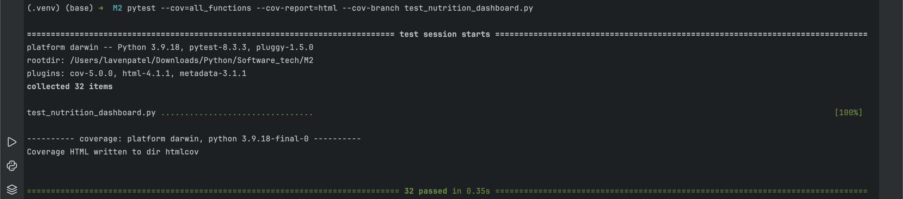
2. App Features and Layout:
    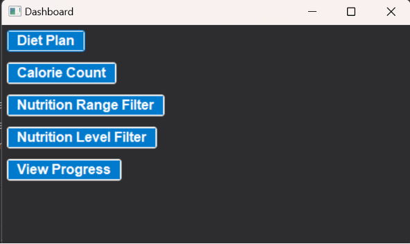
    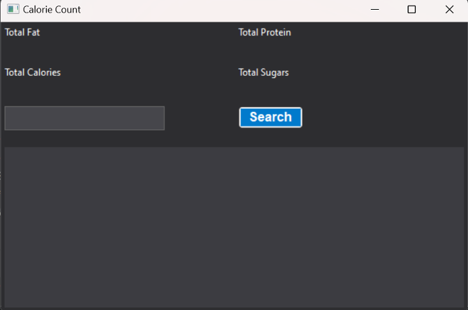
    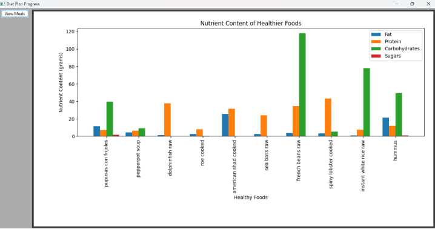
    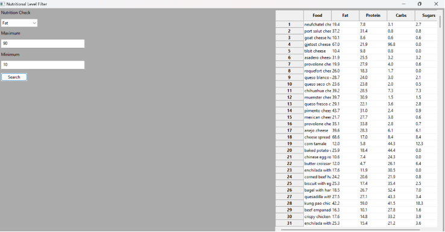
    
    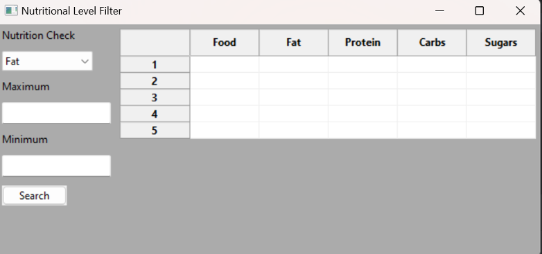
    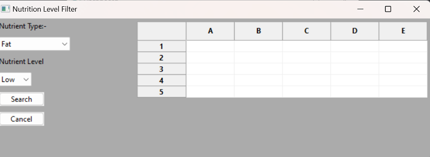
    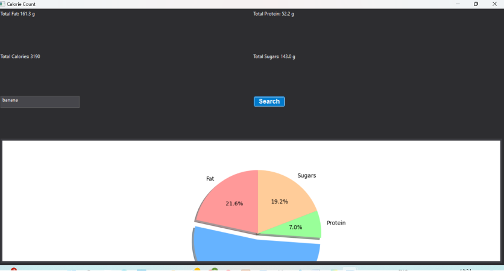
    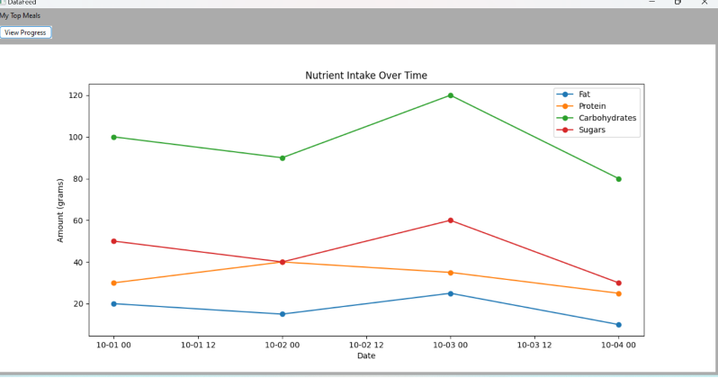

## Future Improvements
   - Enhanced Nutritional Data: Include more nutrients, such as fiber, vitamins, and minerals.
   - Data Logging: Implement a feature for users to save and review daily logs of their food intake.
   - Graphical Visualization: Add visualizations (bar and pie charts) for nutrient distribution and trends.
