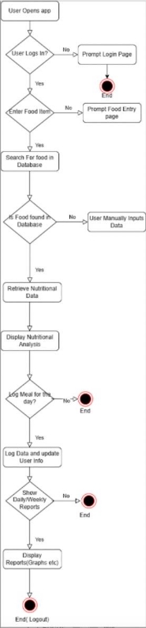
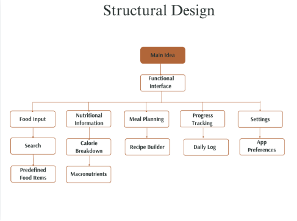
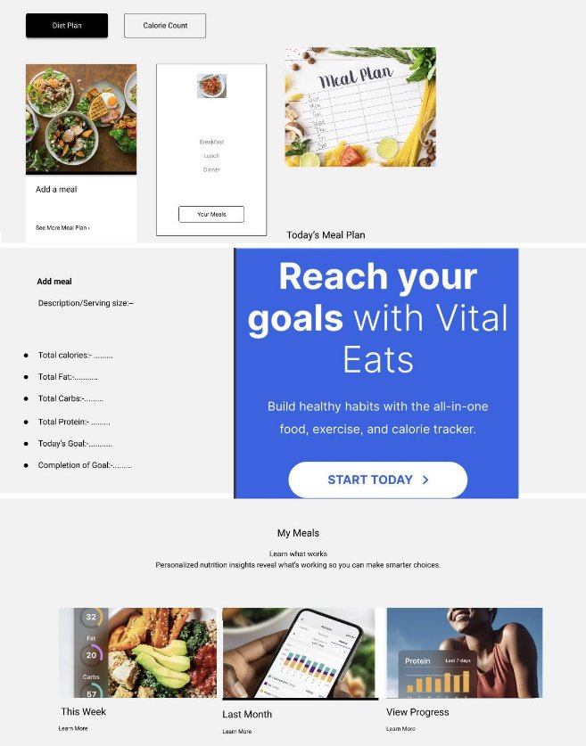

Software Design Document 

Project Name: Vital Eats Group Number: 032      Team members 

**Student Number  Name** s5364886  Laven Vinod Patel s5362233  Shubham s5232738  Drishti Madaan 

TableofContents 

- [Table of Contents ](#_page1_x48.00_y55.92)
  - 1. System Vision 
    - 1.1 Problem Background 
    - 1.2 System capabilities/overview 
    - 1.3 Potential Benefits 
  - 2. Requirements 
    - 2.1 User Requirements 
    - 2.2 Software Requirements 
    - 2.3 Use Case Diagrams 2.4 
    - Use Cases 
  - 3. Software Design and System Components3.1 
    - Software Design 
    - 3.2 System Components 
      - 3.2.1 Functions 
      - 3.2.2 Data Structures / Data Sources 
      - 3.2.3 Detailed Design 
  - 4. User Interface Design 
    - 4.1 Structural Design 
    - 4.2 Visual Design 
1. **System Vision** 
1. **Problem Background** 

In the modern world, there is an increasing prevalence of chronic diseases such as obesity, heart disease, and diabetes,often linked to poor dietary habits. Many individuals lack a clear understanding of the nutritional content of their meals, leading to uninformed dietary decisions. The demand for accessible tools that help people manage and track their nutritional intake is rapidly growing. 

Dataset: Vital Eats will utilize data sourced from the USDA Food Data Central, which offers a comprehensive list of fooditems and their corresponding nutritional values, including both macronutrients (calories, protein, fat, and carbohydrates)and micronutrients (vitamins and minerals). 

Data Input/Output: 

- Input: Users input a food item or recipe and receive nutritional data. (Serving size will be optional) • Output: The systemprovides a detailed nutritional breakdown, including calories, protein, fat, carbohydrates, vitamins, and minerals. 

Target Users: 

- Healthconscious individuals • Fitness enthusiasts • Individuals aiming to improve their diet and make informed food choices. 
2. **System capabilities/overview** 

System Functionality: 

Vital Eats is designed to empower users by analysing and providing insights into the nutritional content of their meals. The system presents nutritional data in a user-friendly format, enabling better dietary decisions. 

Major Roles/Features: 

- Input Food Items: Users can input individual food items or recipes and receive detailed nutritional information. 
- MealPlanning: Users can plan meals according to their dietary goals, ensuring alignment with their nutritional needs.  
- FoodLogging: Users can log their food intake daily, tracking nutritional values and observing trends over time. • Nutritional 
- Visualization: Visual tools, such as charts and graphs, will display the breakdown of calories, macronutrients, and micronutrients, providing clarity on how food choices impact health. 

`  `**Custom Diet Plans**: Users can create and follow personalized diet plans based on individual needs and goals. 

`  `**Real-time Nutritional Analysis**: Instant analysis and feedback on meals input by the user. 

3. **Benefit Analysis** 

User Benefits: 

- Enhanced Nutritional Awareness: Vital Eats enables users to gain a better understanding of the nutritional value of theirmeals and snacks. • Healthier Food Choices: Detailed nutritional data helps users make healthier decisions based on 

dietary preferences and restrictions. • Weight Management: By tracking caloric intake and macronutrient ratios, users can 

manage their weight and achieve fitness goals. Market Potential: 

Given the global trend towards health and fitness, Vital Eats presents significant opportunities for monetization and scaling. The      system could be integrated into meal planning platforms or health tracking applications, attracting potentialinvestors from companies like MyFitnessPal, Cronometer, or Noom. 

2. **Requirements** 
1. **User Requirements** 
- Users should be able to: • Create an Account: Users should be able to create an account to personalize their experienceand save their dietary data. • Input Food Items or Recipes: Users should be able to input food items or recipes and receive a detailed nutritional breakdown, including calories, macronutrients, and micronutrients. • Set dietary goals, suchas daily caloric 

intake or macronutrient ratios (e.g., protein to carbohydrate ratio), and receive guidance on how to meet them. • View graphical reports showing progress over time, with charts or graphs detailing nutrient intake. **Generate Meal Plans**: The system allows users to generate meal plans aligned with their goals (e.g., weight loss, muscle gain). ·  **Progress Notifications**: Automated notifications to users about their dietary progress based on logged data. 

2. **Software Requirements** 
- Functional Requirements: • R1.1: The system shall allow users to input multiple food items or recipes to generate a comprehensive nutritional breakdown. • R1.2: The system shall allow users to save and log their meals for future 

  reference. • R1.3: The system shall generate daily, weekly, and monthly reports based on users' logged data. • R1.4: Thesystem shall suggest personalized meal plans based on users' dietary preferences and goals.  

- **R1.5**: The system shall send notifications to users to track progress toward dietary goals. 
- **R1.6**: The system shall allow real-time input and feedback for nutritional analysis. 

Non-functional Requirements: • Responsiveness: The system shall ensure high responsiveness, with a maximum response time of 2 seconds for food input and analysis. • Data Security: The system shall securely store user data, complying with relevant data 
protection regulations. • Accessibility: The system shall be accessible via both desktop and mobile devices. • Quick Login/Logout: The system shall provide a quick login and logout feature to enhance user convenience and security. • Data Retention and Access: The system shall allow users to view and access their previouslyentered data, including data entered up to a year before. 

3. **Use Case Diagram** 

`  `**Notifications**: User receives dietary progress notifications.  **Diet Plan Generation**: User generates meal plans. 

4. Use case  

Use Case ID **U01** 

Use Case Name Secure Login 

Actors 

User, Admin 

Description 

The user or admin logs in to the system securely by entering their credentials. 

Flow of Events 

1. User or Admin selects "Login." 
1. User or Admin enters their username and password. 
1. The system verifies credentials. 
1. On successful verification, the user is logged in. 
5. The system displays the main dashboard. 

**Alternate Flow** 

If credentials are incorrect, the system displays an error message and prompts for re-entry. 

Use Case ID **U02** 

Use Case Name Input/Search Food 

Actors 

User 

Description 

The user inputs or searches for a food item to receive nutritional data. 

Flow of Events 

1. User selects "Add/Search Food." 
1. User enters the name of the food item or selects it from a list. 
1. The system retrieves data from the nutritional database and displays the nutritional analysis. 

**Alternate Flow** 

If the food item is not found, the user is prompted to manually enter the nutritional data. 

Use Case ID **U03** 

Use Case Name Analyse Nutrition 

Actors 

User 

Description 

The user inputs their food items or recipes, and the system analyses the nutritional values, providing insights. 

Flow of Events 

1. User selects "Analyse Nutrition." 
1. User inputs food items or recipes. 
1. The system calculates calories and nutritional values (carbohydrates, fats, proteins, etc.). 
1. The system displays the results to the user. 

**Alternate Flow** 

If insufficient data is available, the system requests more input or shows a partial analysis. 

Use Case ID **U04** 

Use Case Name Log Meals 

Actors 

User 

Description 

The user logs their meals for tracking purposes. 

Flow of Events 

1. User selects "Log Meals." 
1. User inputs meal details (food items, time, etc.). 
1. The system saves the meal log. 
1. The system displays a confirmation to the user. 

**Alternate Flow** 

If there is an error in input, the system prompts the user to re-enter meal data. 

Use Case ID **U05** 

Use Case Name View Reports 

Actors 

User 

Description 

The user views a graphical representation of their nutritional progress. 

Flow of Events 

1. User selects "View Reports." 
1. The system generates and displays progress reports (e.g., daily, weekly, monthly views). 
1. The system presents graphical representations of caloric intake, nutrient breakdowns, etc. 

**Alternate Flow** 

If there is insufficient data for a report, the system notifies the user and suggests logging more meals. 

Use Case ID **U06** 

Use Case Name 

Set Goals 

Actors User 

Description 

The user sets dietary targets, such as caloric intake or nutrient goals. 

Flow of Events 

1. User selects "Set Goals." 
1. User enters their desired dietary goals. 
1. The system saves the goals and displays a confirmation. 
1. The system adjusts future recommendations based on these goals. 

**Alternate Flow** 

If invalid data is entered (e.g., unrealistic goals), the system prompts the user to revise their input. 

Use Case ID **U07** 

Use Case Name Generate Meal Plans 

Actors 

User 

Description 

The user generates a personalized meal plan based on dietary goals (e.g., weight loss, muscle gain, maintenance). 

Flow of Events 

1. User selects "Generate Meal Plan." 
1. User inputs specific preferences (e.g., caloric intake, meal frequency, dietary restrictions). 
1. The system processes the data and generates a personalized meal plan. 
1. The system displays the generated meal plan to the user, with meal suggestions. 

**Alternate Flow** 

If the user enters conflicting or incomplete data (e.g., caloric intake too low for safe consumption), the system prompts the user to adjust their preferences. 

Use Case ID **U08** 

Use Case Name Receive Notifications 

Actors 

User 

Description 

The system sends notifications to the user based on their dietary progress and meal logging behavior. 

Flow of Events 

1. The system tracks the user's progress, including logged meals and set goals. 
1. When a milestone is reached or progress falls short, the system generates a notification. 
1. The user receives a notification (e.g., "You have not logged meals for 2 days," "You’ve reached 80% of your calorie target today"). 

**Alternate Flow** 

If the user has disabled notifications in the system settings, no notifications will be sent, but progress tracking will continue. 

**3. sof**2**twa**.4**r** **e**U**Design and documents**  

s  

1. **Software Design** 

The flowchart represents the structure of a user centric nutritional analysis app. It begins with the user logging into the application, 

after which they input a food item for analysis. The system searches for the item in its database, and if found,retrieves the nutritional data. If the item is not available, the user can manually input the data. The nutritional breakdown is then displayed, and the user is given the option to log the meal. The app updates the user's progress and offers an option to view daily or weekly reports, 
summarizing their intake in a visual format. Finally, the user can log out to end the session. The flowchart ensures a streamlined 

process for tracking nutrition, facilitating user interaction, and enabling efficient data management. 

**Real-time Analysis:** The system supports real-time input and feedback on nutrition. 

**Notification System:** Users will receive automated notifications based on their meal logs and dietary goals.

2. **System Components** 
1. **Functions** 
1. Function Name: calculateNutritionalValue()• Description: This function calculates the total calories andmacronutrient breakdown (protein, carbs, fats) of a food item or recipe. • Input Parameters: 

   foodItem: The name or identifier of the food item. servingSize: The quantity or portion size of the food item. •Return Value: Nutritional breakdown: A detailed analysis including calories, macronutrients, vitamins, and minerals. • Side Effects: 

   May update the user’s logged data if this function is called during meal logging. Can trigger updates to progressreports and visual graphs if tied to Realtime tracking. Potentially increases system load during the processing ofcomplex recipes or large 

   quantities of data, which could slightly affect response times. 

2. Function Name: assessBehavioralImpact() •  Description: This  function  evaluates  the  potential psychological and emotional side effects of the user’s behaviour within the application. It monitors patterns suchas frequent checking of nutritional data, obsessive logging of meals, or excessive focus on caloric intake, whichcould lead to negative mental health outcomes like anxiety, stress, or depression. • Input Parameters: 

   userActivityData: A record of the user's interactions with the system, such as frequency of logins, number oftimes nutritional data is checked, and the consistency of meal logging. timeSpent: The duration of time the userspends analysing their nutritional data within the application. • Return Value: 

   impact Assessment: A summary of the potential psychological or emotional side effects, including risk levels(e.g., low, moderate, high) for issues such as anxiety or stress. recommendations: Suggestions for healthier app usage, such as limiting the number of times nutritional data is checked or setting up reminders to take breaks. • Side Effects: 

   The system may trigger alerts or notifications encouraging the user to take a break if high-risk behaviour is detected. If 

   the function detects potentially harmful behaviour patterns, it could suggest resources for mentalhealth support or offer 

   the option to adjust user settings to reduce the focus on calorie counting. 

**Function Name:** generateDietPlan() 

**Description**: Generates a custom diet plan for the user based on their goals. **Input Parameters**: 

goalType: The user’s dietary goal (e.g., weight loss). 

**Return Value**: A structured diet plan with meal suggestions. 

2. **Data Structures / Data Sources** 
- Type: Dictionary Usage: To store nutritional data for various food items. The dictionary would have food names as keysand their corresponding nutritional values (calories, protein, fats, carbohydrates, vitamins, etc.) as values. Functions: calculateNutritionalValue(): Retrieves nutritional data for a food item from the dictionary. inputFoodItem(): Updates or 

adds new food item data in the dictionary if manually entered by the user. generateNutritionalAnalysis(): Accesses thedictionary to display a nutritional breakdown. 

- Type: List Usage: To maintain a log of meals entered by the user. Each meal could be an entry in the list, containing food items 

and their serving sizes. Functions: logMeals(): Adds a meal entry to the list with all the relevant food items and 

servings. viewReports(): Processes the list of meals to generate graphical reports based on logged meals over a givenperiod. 

- Type: Set Usage: To keep track of unique food items entered by the user, preventing duplicate entries. Functions: inputFoodItem(): Adds new food items to the set and ensures that the user doesn't enter duplicate food items. 
- Type: Database (USDA Food Data Central) Usage: External data source to retrieve nutritional data for various food items. 

When a user inputs a food item, the system queries this database to fetch accurate nutritional values. Functions: inputFoodItem(): Queries the database to fetch nutritional information based on the user input. 

calculateNutritionalValue(): Retrieves values from the database to compute the overall nutritional content. 

**Type**: Queue 

**Usage**: To handle notifications to users regarding meal tracking and goals. 

3. **Detailed Design** 

**Data Structures / Data Sources** 

1. Type: Dictionary Usage: To store nutritional data for various food items. The dictionary would have food names askeys and their corresponding nutritional values (calories, protein, fats, carbohydrates, vitamins, etc.) as values. Functions: calculateNutritionalValue(): Retrieves nutritional data for a food item from the dictionary. inputFoodItem(): Updates or adds new food item data in the dictionary if manually entered by the user. generateNutritionalAnalysis(): Accesses the dictionary to display a nutritional breakdown. 
1. Type: List Usage: To maintain a log of meals entered by the user. Each meal could be an entry in the list, containing food items and their serving sizes. Functions: logMeals(): Adds a meal entry to the list with all therelevant food items and servings. viewReports(): Processes the list of meals to generate graphical reports based on logged meals over a given period. 
1. Type: Set Usage: To keep track of unique food items entered by the user, preventing duplicate entries. Functions: inputFoodItem(): Adds new food items to the set and ensures that the user doesn't enter duplicate food items. 
1. Type: Database (USDA Food Data Central) Usage: External data source to retrieve nutritional data for various food items. When a user inputs a food item, the system queries this database to fetch accurate nutritional values.Functions: inputFoodItem(): Queries the database to fetch nutritional information based on the user input. calculateNutritionalValue(): Retrieves values from the database to compute the overall nutritionalcontent 3.2.3 Detailed Design (Pseudocode) 
1. Function Name: calculateNutritionalValue()Description: Calculates the total nutritional content of a fooditem or recipe. Pseudocode: 

function calculateNutritionalValue(foodItem, servingSize): if foodItem exists in nutritionalDatabase: nutritionData = 
nutritionalDatabase[foodItem] calories = nutritionData['calories'] \* servingSize protein = nutritionData['protein'] \* servingSize fat = nutritionData['fat'] \* servingSize carbs = nutritionData['carbs'] \* servingSize return {"calories": calories,"protein": protein, "fat": fat, "carbs": carbs} else: return "Food item not found” 

2. Function Name: logMeals()Description: Logs a user's meal and tracks their daily nutritional intake. 

function logMeals(mealItems): totalNutritionalValue = {"calories": 0, "protein": 0, "fat": 0, "carbs": 0} for item in mealItems:       itemNutrition = calculateNutritionalValue(item.food, item.servingSize) totalNutritionalValue["calories"] += 
itemNutrition["calories"] totalNutritionalValue["protein"] += itemNutrition["protein"] totalNutritionalValue["fat"] += 
itemNutrition["fat"] totalNutritionalValue["carbs"] += itemNutrition["carbs"] add to mealsLog(totalNutritionalValue) return "Meal logged successfully" 

3. Function Name: viewReports() Description:  Generates graphical reports based on the user's logged  meals. Pseudocode: 

function viewReports(timeframe): reportData = getLoggedMeals(timeframe) generateGraph(reportData) return "Reportgenerated" 

4. User Interface Design 
1. **Structural Design** 

The software is structured into a hierarchical system, starting from the "Main Idea" at the top level, which branches downinto a "Functional Interface." This interface is further divided into five primary components: 

- Food Input • Nutritional Information • Meal Planning • Progress Tracking • Settings 

Each of these primary components has its own subcomponents that further define the specific functionalities. 

Information is organized based on the core functionalities of the app, with each primary component representing adifferent aspect of the user experience: 

- Food Input: This section allows users to search for and select predefined food items. • Nutritional Information: Information 

is grouped into calorie breakdowns and macronutrients. • Meal Planning: This includes a Recipe Builder, 

helping users create and organize their meals. • Progress Tracking: This area includes a Daily Log where users can tracktheir 

nutritional and fitness progress. • Settings: This section allows users to manage their app preferences. 

Users will navigate through the software using a clear and intuitive interface that likely includes a menu or tabs corresponding to the five primary components. From each primary section, users can drill down into more specificsubcomponents, allowing for a 
straightforward navigation experience: 

- Food Input: Users can start by searching for food or selecting predefined items. • Nutritional Information: Users can view 

calorie breakdowns and detailed macronutrient information. • Meal Planning: Users can build and organize recipes. 

- Progress Tracking: Users can log daily progress and track their nutrition and fitness journey. • Settings: Users canadjust preferences to tailor the app to their needs. 

The design choices reflect a user-centric approach focused on simplicity and functionality: 

- Hierarchy: The hierarchical structure allows for clear categorization of features, ensuring that users can easily find anduse the app's functionalities. • Modularity: Each section is modular, meaning that users can interact with one aspect of 

  the app without being overwhelmed by others. For instance, users focused on meal planning can do so without navigating through unrelated features. • Clear Grouping: Grouping related features together, such as calorie breakdown and macronutrients under      "Nutritional Information," helps users make informed decisions based on their goals. • Ease ofNavigation: The structure supports easy navigation, helping users move smoothly between different sections of the app. 

  These design choices were likely made to enhance the user experience by providing a logical and easy-to-navigateinterface while ensuring all essential features are easily accessible. 

- Food Input • Nutritional Information • Meal Planning • Progress Tracking • Settings 

Each of these primary components has its own subcomponents that further define the specific functionalities. 

Information is organized based on the core functionalities of the app, with each primary component representing adifferent aspect of the user experience: 

- Food Input: This section allows users to search for and select predefined food items. • Nutritional Information: Information 

is grouped into calorie breakdowns and macronutrients. • Meal Planning: This includes a Recipe Builder, 

helping users create and organize their meals. • Progress Tracking: This area includes a Daily Log where users can tracktheir 

nutritional and fitness progress. • Settings: This section allows users to manage their app preferences. 

Users will navigate through the software using a clear and intuitive interface that likely includes a menu or tabs corresponding to the five primary components. From each primary section, users can drill down into more specificsubcomponents, allowing for a 
straightforward navigation experience: 

- Food Input: Users can start by searching for food or selecting predefined items. • Nutritional Information: Users can view 

calorie breakdowns and detailed macronutrient information. • Meal Planning: Users can build and organize recipes. 

- Progress Tracking: Users can log daily progress and track their nutrition and fitness journey. • Settings: Users canadjust preferences to tailor the app to their needs. 

The design choices reflect a user-centric approach focused on simplicity and functionality: 

- Hierarchy: The hierarchical structure allows for clear categorization of features, ensuring that users can easily find anduse the app's functionalities. • Modularity: Each section is modular, meaning that users can interact with one aspect of 

  the app without being overwhelmed by others. For instance, users focused on meal planning can do so without navigating through unrelated features. • Clear Grouping: Grouping related features together, such as calorie breakdown and macronutrients under "Nutritional Information," helps users make informed decisions based on their goals. • Ease ofNavigation: The structure supports 

easy navigation, helping users move smoothly between different sections of the app. 

**Notification Feature:** The UI will include a notification section showing dietary progress updates. 

`  `**Diet Plan Section:** A dedicated section for generating and viewing custom diet plans. 

These design choices were likely made to enhance the user experience by providing a logical and easy-to-navigateinterface while ensuring all essential features are easily accessible. 

2. **Visual Design** 

The design emphasizes clarity, easy navigation, and a user-friendly interface, making it simple for users to track andmanage their 

dietary habits effectively. 

1. Header Design Diet Plan and Calorie Count Buttons: Positioned prominently at the top of the page, these buttonsallow users to quickly navigate between two core features of the app. 
1. Main Content Area Meal Plan Section: This section features options like "Add a meal," "Your Meals," and a visual representation of the day's meal plan. The layout is structured in a grid format, offering users a clear and organized way to manage their meals. Today's Meal Plan Section: Centrally located, this section provides a snapshot of the user’s current meal plan, both visually and textually. 
1. Advertisement/Call-to-Action Section Reaching Goals with Vital Eats: A prominent blue banner designed to catchthe user’s attention and encourage them to engage with the service. The call-to-action is clear, urging users to "Start Today." 
1. Detailed Meal Section Add Meal Section: This section allows users to enter meal details such as calories, fat,carbs, and protein. It is straightforward and focuses on ease of data entry. 
1. My Meals Section Historical Data and Insights: Displays historical meal data through images and graphs, withoptions to view data from "This Week," "Last Month," and track overall progress. The design is clean and informative, helping users easily access their nutritional history. 
1. **Diet Plan Generator:** A simple form to select a dietary goal and view the meal plan results. 

