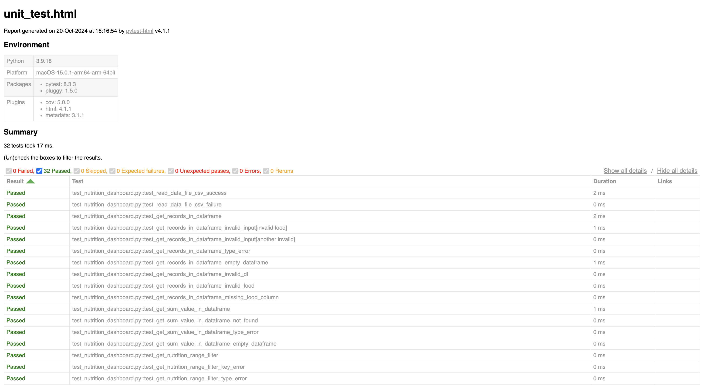

# Unit Testing Report

Please provide your GitHub repository link.
### GitHub Repository URL: https://github.com/Swigstan1810/Milestone1_Group32

---

The testing report should focus solely on <span style="color:red"> testing all the self-defined functions related to 
the five required features.</span> There is no need to test the GUI components. Therefore, it is essential to decouple your code and separate the logic from the GUI-related code.


## 1. **Test Summary**

Below is a list of all tested functions related to the five required features and the corresponding test functions designed to validate them:


| **Tested Functions**                                  | **Test Functions**                                                             |
|-------------------------------------------------------|--------------------------------------------------------------------------------|
| `read_data_file_csv(filepath)`                        | `test_read_data_file_csv_success()` <br> `test_read_data_file_csv_failure()`    |
| `get_records_in_dataframe(food, df)`                 | `test_get_records_in_dataframe()` <br> `test_get_records_in_dataframe_invalid_input()` <br> `test_get_records_in_dataframe_type_error()` <br> `test_get_records_in_dataframe_empty_dataframe()` <br> `test_get_records_in_dataframe_invalid_food()` <br> `test_get_records_in_dataframe_missing_food_column()` |
| `get_sum_value_in_dataframe(food, df)`               | `test_get_sum_value_in_dataframe()` <br> `test_get_sum_value_in_dataframe_not_found()` <br> `test_get_sum_value_in_dataframe_type_error()` <br> `test_get_sum_value_in_dataframe_empty_dataframe()` |
| `get_nutrition_range_filter(nutrient, min_value, max_value, df)` | `test_get_nutrition_range_filter()` <br> `test_get_nutrition_range_filter_key_error()` <br> `test_get_nutrition_range_filter_type_error()` <br> `test_get_nutrition_range_filter_invalid_range()` |
| `get_highest_lowest_nutrition_level_filter(nutrient, df)` | `test_get_highest_lowest_nutrition_level_filter()` <br> `test_get_highest_lowest_nutrition_level_filter_key_error()` <br> `test_get_highest_lowest_nutrition_level_filter_type_error()` |
| `get_list_5food_max_nutrition(nutrient, df)`         | `test_get_list_5food_max_nutrition()` <br> `test_get_list_5food_max_nutrition_key_error()` <br> `test_get_list_5food_max_nutrition_type_error()` |
| `get_list_5food_min_nutrition(nutrient, df)`         | `test_get_list_5food_min_nutrition()` <br> `test_get_list_5food_min_nutrition_key_error()` <br> `test_get_list_5food_min_nutrition_type_error()` |
| `get_two_foods_with_nutritions(food1, food2, df)`    | `test_get_two_foods_with_nutritions()` <br> `test_get_two_foods_with_nutritions_not_found()` <br> `test_get_two_foods_with_nutritions_type_error()` <br> `test_get_two_foods_with_nutritions_both_invalid()` <br> `test_get_two_foods_with_nutritions_empty_dataframe()` |


---

## 2. **Test Case Details**

### Test Case 1: read_data_file_csv(filepath)
- **Test Function/Module**
  - `test_read_data_file_csv_success()`
  - `test_read_data_file_csv_failure()`
- **Tested Function/Module**
  - `read_data_file_csv(filepath)`
- **Description**
  - This function tests the CSV reading logic, ensuring that the file is read correctly and handles errors like file-not-found.
- **1) Valid Input and Expected Output**  

| **Input**                           | **Expected Output**                        |
|-------------------------------------|--------------------------------------------|
| A valid CSV file with food data     | DataFrame with valid food and nutrition columns |
  

- **1) Code for the Test Function**
```python
def test_read_data_file_csv_success():
    with patch('pandas.read_csv') as mock_read_csv:
        mock_read_csv.return_value = pd.DataFrame({'food': ['apple'], 'nutrition_value': [50]})
        df = read_data_file_csv('test.csv')
        assert df is not None
        assert 'food' in df.columns
```
- **2) Invalid Input and Expected Output**

| **Invalid Input**             |    **Expected Output**         |
|-------------------------------|   ---------------------        |
| `Non-existing file path`      | `Raises FileNotFoundError`     |


- **2) Code for the Test Function**
```python
def test_read_data_file_csv_failure():
    with pytest.raises(FileNotFoundError):
        read_data_file_csv('nonexistent.csv')
```
### Test Case 2:
- **Test Function/Module**
  - `test_get_sum_value_in_dataframe()`
  - `test_get_sum_value_in_dataframe_invalid_input()`
  - `test_get_sum_value_in_dataframe_type_error()`
- **Tested Function/Module**
  - `get_sum_value_in_dataframe(food, df)`
- **Description**
  - This function calculates the sum of nutrition values for a given food.
- **1) Valid Input and Expected Output**  

| **Valid Input**                                      | **Expected Output**                  |
|------------------------------------------------------|--------------------------------------|
| `food: "apple", DataFrame with values`               | `Sum of nutrition values for "apple"`|


- **1) Code for the Test Function**
```python
def test_get_records_in_dataframe():
    df = pd.DataFrame({
        'food': ['apple', 'banana', 'carrot'],
        'nutrition_value': [50, 70, 30]
    })

    result = get_records_in_dataframe('apple', df)
    assert len(result) == 1
    assert result['food'].iloc[0] == 'apple'

```
- **2) Invalid Input and Expected Output**

| **Invalid Input**                         |      **Expected Output**     |
|-------------------------------------------|------------------------------|
| `food: "orange", DataFrame`               | `DataFrame should be empty`  |
| `food: "invalid food", DataFrame`         | `DataFrame should be empty`  |

- **2) Code for the Test Function**
```python
@pytest.mark.parametrize("food", ['invalid food', 'another invalid'])
def test_get_records_in_dataframe_invalid_input(sample_df, food):
    result = get_records_in_dataframe(food, sample_df)
    assert result.empty, f"No records should be found for {food}."
```

### Test Case 3:
- **Test Function/Module**
  - `test_get_sum_value_in_dataframe()`
  - `test_get_sum_value_in_dataframe_not_found()`
  - `test_get_sum_value_in_dataframe_type_error()`
  - `test_get_sum_value_in_dataframe_empty_dataframe()`

- **Tested Function/Module**
  - `get_sum_value_in_dataframe(food, df)`
- **Description**
  - This function calculates the sum of nutrition values for a given food.
- **1) Valid Input and Expected Output**  

| **Valid Input**               | **Expected Output**                     |
|-------------------------------|-----------------------------------------|
| `food: "banana", DataFrame`   | `Sum of nutrition values for "banana"`  |

- **1) Code for the Test Function**
```python
def test_get_sum_value_in_dataframe(sample_df):
    result = get_sum_value_in_dataframe('banana', sample_df)
    assert result == 70
```
- **2) Invalid Input and Expected Output**

| **Invalid Input**                 | **Expected Output**     |
|-----------------------------------|-------------------------|
| `food: "invalid food", DataFrame` | `Sum should be 0`       |

- **2) Code for the Test Function**
```python
def test_get_sum_value_in_dataframe_not_found(sample_df):
    result = get_sum_value_in_dataframe('invalid food', sample_df)
    assert result == 0
```

### Test Case 4:
- **Test Function/Module**
  - `test_get_nutrition_range_filter()`
  - `test_get_nutrition_range_filter_key_error()`
  - `test_get_nutrition_range_filter_type_error()`
  - `test_get_nutrition_range_filter_invalid_range()`
- **Tested Function/Module**
  - `get_nutrition_range_filter(nutrient, min_value, max_value, df)`
- **Description**
  - This function filters the DataFrame for foods within a specified nutrition range.
- **1) Valid Input and Expected Output**  

| **Valid Input**                                                | **Expected Output** |
|----------------------------------------------------------------|---------------------|
| `nutrient: "nutrition_value", min: 50, max: 100`               | `5`                 |


- **1) Code for the Test Function**
```python
def test_get_nutrition_range_filter(sample_df):
    result = get_nutrition_range_filter('nutrition_value', 50, 100, sample_df)
    assert len(result) == 4
```
- **2) Invalid Input and Expected Output**

| **Invalid Input**                                               | **Expected Output**|
|-----------------------------------------------------------------|--------------------|
| `nutrient: "invalid_nutrient", min: 50, max: 100`               | `Raises KeyError`  |


- **2) Code for the Test Function**
```python
def test_get_nutrition_range_filter_key_error(sample_df):
    with pytest.raises(KeyError):
        get_nutrition_range_filter('invalid_nutrient', 50, 100, sample_df)
```


### Test Case 5:
- **Test Function/Module**
  - `test_get_highest_lowest_nutrition_level_filter()`
  - `test_get_highest_lowest_nutrition_level_filter_key_error()`
  - `test_get_highest_lowest_nutrition_level_filter_type_error()`
- **Tested Function/Module**
  - `get_highest_lowest_nutrition_level_filter(nutrient, df)`
- **Description**A brief de
  - This function identifies the foods with the highest and lowest values for a specified nutrient.
- **1) Valid Input and Expected Output**  

| **Valid Input**                             | **Expected Output**                              |
|---------------------------------------------|--------------------------------------------------|
| `nutrient: "nutrition_value"`               | `Highest and lowest foods for "nutrition_value"` |


- **1) Code for the Test Function**
```python
def test_get_highest_lowest_nutrition_level_filter(sample_df):
    highest, lowest = get_highest_lowest_nutrition_level_filter('nutrition_value', sample_df)
    assert highest['nutrition_value'].iloc[0] >= lowest['nutrition_value'].iloc[0]
```
- **2) Invalid Input and Expected Output**

| **Invalid Input**             | **Expected Output** |
|-------------------------------|---------------------|
| `nutrient: "invalid_nutrient"`| `Raises KeyError`   |

- **2) Code for the Test Function**
```python
def test_get_highest_lowest_nutrition_level_filter_key_error(sample_df):
    with pytest.raises(KeyError):
        get_highest_lowest_nutrition_level_filter('invalid_nutrient', sample_df)
```


### Test Case 6:
- **Test Function/Module**
  - `test_get_list_5food_max_nutrition()`
  - `test_get_list_5food_max_nutrition_key_error()`
  - `test_get_list_5food_max_nutrition_type_error()`
- **Tested Function/Module**
  - `get_list_5food_max_nutrition(nutrient, df)`
- **Description**
  - This function retrieves the top five foods based on the maximum values of a specified nutrient.
- **1) Valid Input and Expected Output**  

| **Valid Input**               | **Expected Output**                                 |
|-------------------------------|-----------------------------------------------------|
| `nutrient: "nutrition_value"` | `DataFrame with top 5 foods for "nutrition_value"`  |

- **1) Code for the Test Function**
```python
def test_get_list_5food_max_nutrition(sample_df):
    result = get_list_5food_max_nutrition('nutrition_value', sample_df)
    assert len(result) <= 5
```
- **2) Invalid Input and Expected Output**

| **Invalid Input**             | **Expected Output** |
|-------------------------------|---------------------|
| `nutrient: "invalid_nutrient"`| `Raises KeyError`   |

- **2) Code for the Test Function**
```python
def test_get_list_5food_max_nutrition_key_error(sample_df):
    with pytest.raises(KeyError):
        get_list_5food_max_nutrition('invalid_nutrient', sample_df)
```


### Test Case 7:
- **Test Function/Module**
  - `test_get_list_5food_min_nutrition()`
  - `test_get_list_5food_min_nutrition_key_error()`
  - `test_get_list_5food_min_nutrition_type_error()`
- **Tested Function/Module**
  - `get_list_5food_min_nutrition(nutrient, df)`
- **Description**
  - This function retrieves the bottom five foods based on the minimum values of a specified nutrient.
- **1) Valid Input and Expected Output**  

| **Valid Input**               | **Expected Output**                                    |
|-------------------------------|--------------------------------------------------------|
| `nutrient: "nutrition_value"` | `DataFrame with bottom 5 foods for "nutrition_value"`  |

- **1) Code for the Test Function**
```python
def test_get_list_5food_min_nutrition(sample_df):
    result = get_list_5food_min_nutrition('nutrition_value', sample_df)
    assert len(result) <= 5
```
- **2) Invalid Input and Expected Output**

| **Invalid Input**             | **Expected Output** |
|-------------------------------|---------------------|
| `nutrient: "invalid_nutrient"`| `Raises KeyError`   |

- **2) Code for the Test Function**
```python
def test_get_list_5food_min_nutrition_key_error(sample_df):
    with pytest.raises(KeyError):
        get_list_5food_min_nutrition('invalid_nutrient', sample_df)
```


### Test Case 8:
- **Test Function/Module**
  - `test_get_two_foods_with_nutritions()`
  - `test_get_two_foods_with_nutritions_not_found()`
  - `test_get_two_foods_with_nutritions_type_error()`
  - `test_get_two_foods_with_nutritions_both_invalid()`
  - `test_get_two_foods_with_nutritions_empty_dataframe()`
- **Tested Function/Module**
  - `get_two_foods_with_nutritions(food1,food2, df)`
- **Description**
  - This function retrieves the nutrition values for two specified food items.
- **1) Valid Input and Expected Output**  

| **Valid Input**                   | **Expected Output**                                   |
|-----------------------------------|-------------------------------------------------------|
| `food1: "apple", food2: "banana"` |  `DataFrame with nutrition values for both foods`     |

- **1) Code for the Test Function**
```python
def test_get_two_foods_with_nutritions(sample_df):
    result = get_two_foods_with_nutritions('apple', 'banana', sample_df)
    assert len(result) == 2
```
- **2) Invalid Input and Expected Output**

| **Invalid Input**                              | **Expected Output**                            |
|------------------------------------------------|------------------------------------------------|
| `food1: "invalid food", food2: "banana"`       | `DataFrame with nutrition for "banana" only`   |
| `food1: "invalid food", food2: "invalid food""`| `Empty DataFrame`                              |


- **2) Code for the Test Function**
```python
def test_get_two_foods_with_nutritions_not_found(sample_df):
    result = get_two_foods_with_nutritions('invalid food', 'banana', sample_df)
    assert len(result) == 1
```


